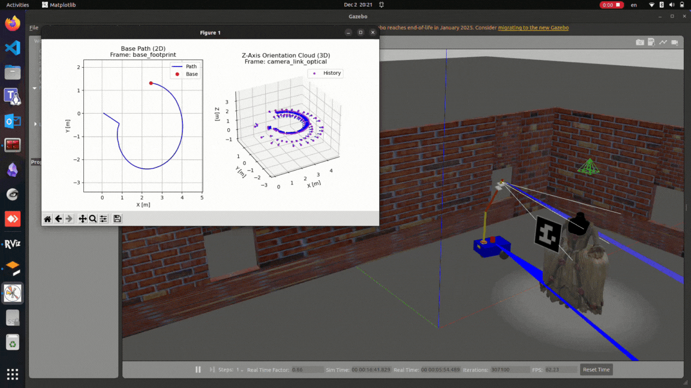

# Pose Tracking Data Logs

<p style="text-align: justify;">
The robotic system also features real-time telemetry logging. The UGV's path is visualized on a 2D plot and stored in ugv_path_data.json, while a separate diagram captures the camera's pose and orientation history
</p>

### Steps

<p style="text-align: justify;">
Inside the folder `my_robot_description`, open four terminal windows.
In the first terminal, execute the following commands:
</p>
```
source install/setup.bash
```
after

```
ros2 launch my_robot_bringup my_robot_gazebo.launch.xml 
```

Then, in the second terminal, run:

```
source install/setup.bash
```
after

```
ros2 launch my_robot_bringup world_tf.launch.py
```

in a separate terminal:
```
source install/setup.bash
```
after
```
ros2 run robot_controller go_with_arm
```

and in a separate terminal:
```
source install/setup.bash
```
after
```
ros2 run robot_controller position_detect
```

<p align="center">
  
</p>
